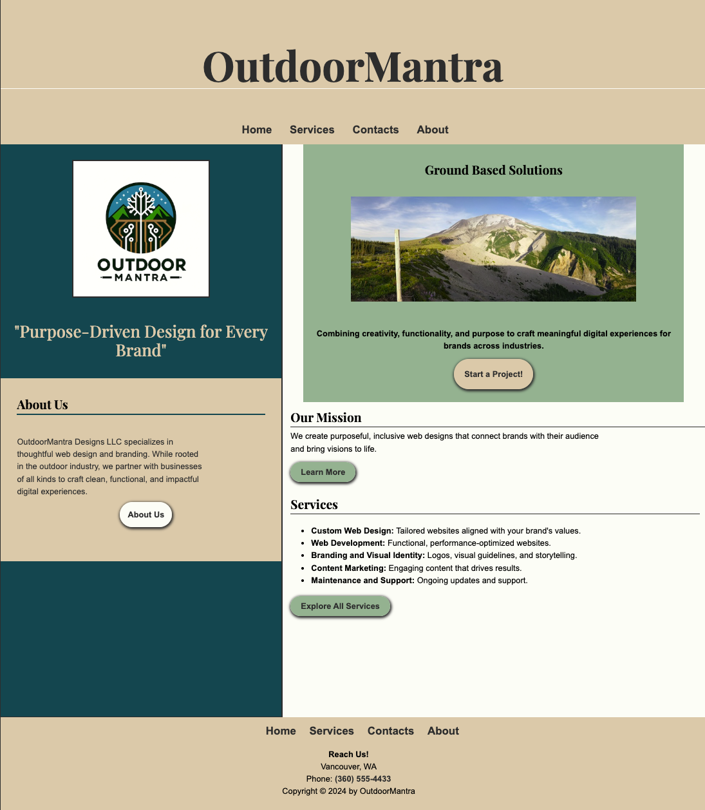

# Outdoor Mantra

A mock web design and development agency site built as the CTEC 122 final
project. Four-page responsive layout with consistent navigation, semantic
HTML throughout, and a working contact form.

## Pages

- `home.html` — Two-column landing page with company intro
- `services.html` — Agency services and offerings
- `about.html` — Company background and team info
- `contact.html` — Contact form with state select, radio buttons, and email input

## Features

- Shared `css/style.css` across all four pages with `normalize.css`
- Two responsive breakpoints — desktop two-column layout collapses to single column
- Navigation in header and footer, consistent across all pages, styled with LoVHFA
- Contact form posts to CTEC form processor
- No inline CSS anywhere in the project
- All images licensed for use with proper `alt`, `height`, and `width` attributes
- Passes WAVE with zero errors, alerts, or contrast errors across all pages and breakpoints
- HTML and CSS validated on all pages

## Preview

[Outdoor Mantra homepage](ctec122_Final.mov)

## Technologies

- HTML5 (semantic)
- CSS3
- normalize.css
